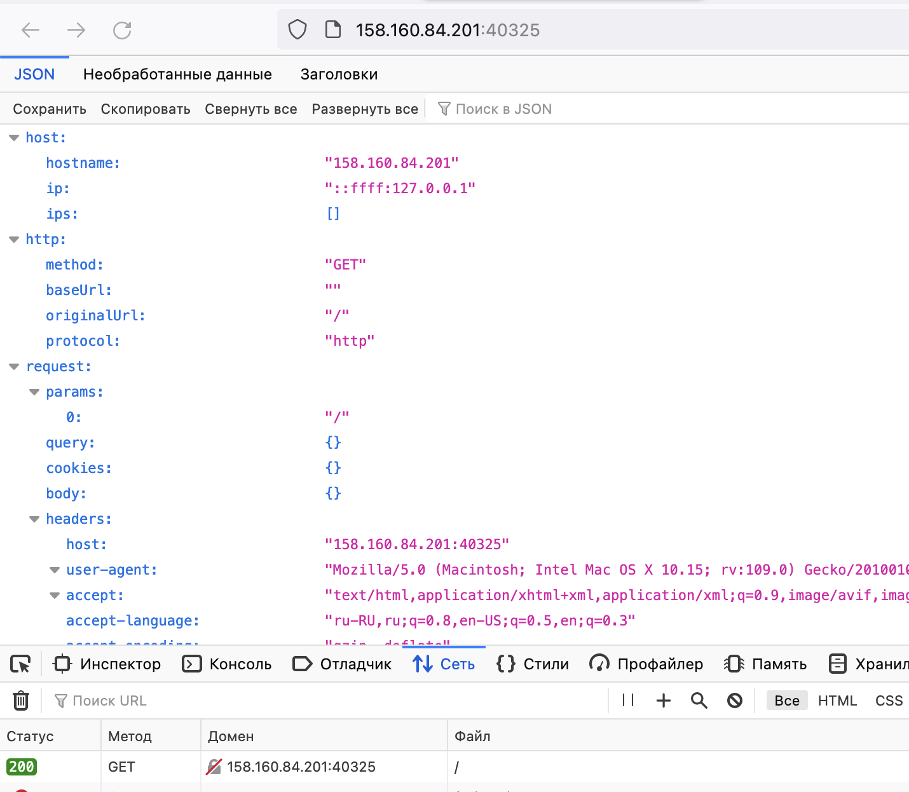
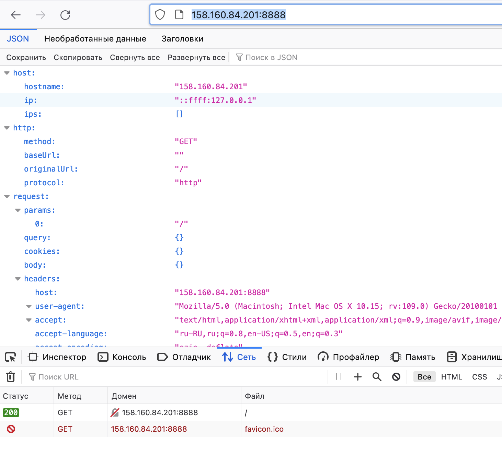

# Домашнее задание к занятию «Базовые объекты K8S»

### Цель задания

В тестовой среде для работы с Kubernetes, установленной в предыдущем ДЗ, необходимо развернуть Pod с приложением и подключиться к нему со своего локального компьютера. 

------

### Задание 1. Создать Pod с именем hello-world

1. Создать манифест (yaml-конфигурацию) Pod.
2. Использовать image - gcr.io/kubernetes-e2e-test-images/echoserver:2.2.  
- Указанный image не рабочий, использовал ealen/echo-server:0.8.10
```
yura@ubuntu-test:~$ touch simple-pod.yaml
yura@ubuntu-test:~$ sudo vim simple-pod.yaml
yura@ubuntu-test:~$ cat simple-pod.yaml 
apiVersion: v1
kind: Pod
metadata:
  name: myapp
  labels:
    app: myapp
spec:
  containers:
  - name: myapp
    image: ealen/echo-server:0.8.10
yura@ubuntu-test:~$ kubectl create -f simple-pod.yaml
pod/myapp created
```
3. Подключиться локально к Pod с помощью `kubectl port-forward` и вывести значение (curl или в браузере).
```
yura@ubuntu-test:~$ kubectl port-forward pods/myapp :80 --address 0.0.0.0
Forwarding from 0.0.0.0:40325 -> 80
Handling connection for 40325
```
<p align="center">
  
</p>

------

### Задание 2. Создать Service и подключить его к Pod

1. Создать Pod с именем netology-web.
```
yura@ubuntu-test:~$ cat simple-pod.yaml 
apiVersion: v1
kind: Pod
metadata:
  name: netology-web
  labels:
    app: netology-web
spec:
  containers:
  - name: netology-web
    image: ealen/echo-server:0.8.10
yura@ubuntu-test:~$ kubectl create -f simple-pod.yaml
pod/netology-web created
```
2. Использовать image — gcr.io/kubernetes-e2e-test-images/echoserver:2.2.
- Указанный image не рабочий, использовал ealen/echo-server:0.8.10
3. Создать Service с именем netology-svc и подключить к netology-web.
```
yura@ubuntu-test:~$ cat netology-svc.yaml 
apiVersion: v1
kind: Service
metadata:
  name: netology-svc
spec:
  selector:
    app: netology-web
  ports:
    - protocol: TCP
      port: 80
yura@ubuntu-test:~$ kubectl create -f netology-svc.yaml
service/netology-svc created
yura@ubuntu-test:~$ kubectl describe svc netology-svc
Name:              netology-svc
Namespace:         default
Labels:            <none>
Annotations:       <none>
Selector:          app=netology-web
Type:              ClusterIP
IP Family Policy:  SingleStack
IP Families:       IPv4
IP:                10.152.183.206
IPs:               10.152.183.206
Port:              <unset>  80/TCP
TargetPort:        80/TCP
Endpoints:         10.1.207.173:80
Session Affinity:  None
Events:            <none>
```
4. Подключиться локально к Service с помощью `kubectl port-forward` и вывести значение (curl или в браузере).
```
yura@ubuntu-test:~$ kubectl port-forward svc/netology-svc 8888:80 --address 0.0.0.0
Forwarding from 0.0.0.0:8888 -> 80
Handling connection for 8888

yura@Skynet ~ % curl 158.160.84.201:8888
{"host":{"hostname":"158.160.84.201","ip":"::ffff:127.0.0.1","ips":[]},"http":{"method":"GET","baseUrl":"","originalUrl":"/","protocol":"http"},"request":{"params":{"0":"/"},"query":{},"cookies":{},"body":{},"headers":{"host":"158.160.84.201:8888","user-agent":"curl/8.1.2","accept":"*/*"}},"environment":{"PATH":"/usr/local/sbin:/usr/local/bin:/usr/sbin:/usr/bin:/sbin:/bin","HOSTNAME":"netology-web","NODE_VERSION":"18.18.2","YARN_VERSION":"1.22.19","KUBERNETES_PORT_443_TCP_ADDR":"10.152.183.1","KUBERNETES_SERVICE_HOST":"10.152.183.1","KUBERNETES_SERVICE_PORT":"443","KUBERNETES_SERVICE_PORT_HTTPS":"443","KUBERNETES_PORT":"tcp://10.152.183.1:443","KUBERNETES_PORT_443_TCP":"tcp://10.152.183.1:443","KUBERNETES_PORT_443_TCP_PROTO":"tcp","KUBERNETES_PORT_443_TCP_PORT":"443","HOME":"/root"}}
```
<p align="center">
  
</p>
------